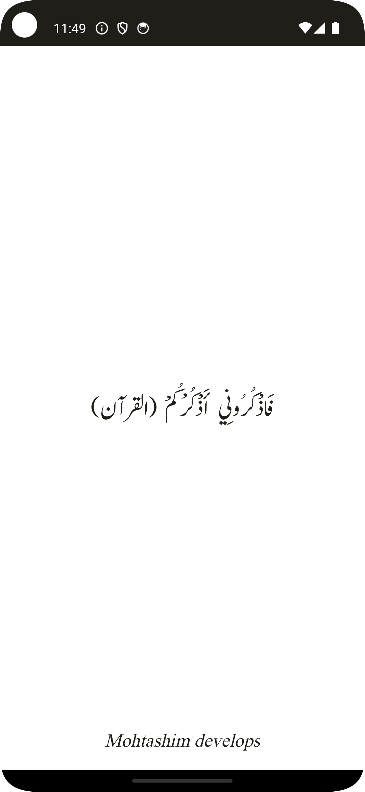
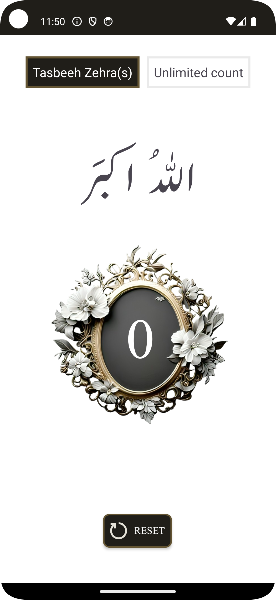
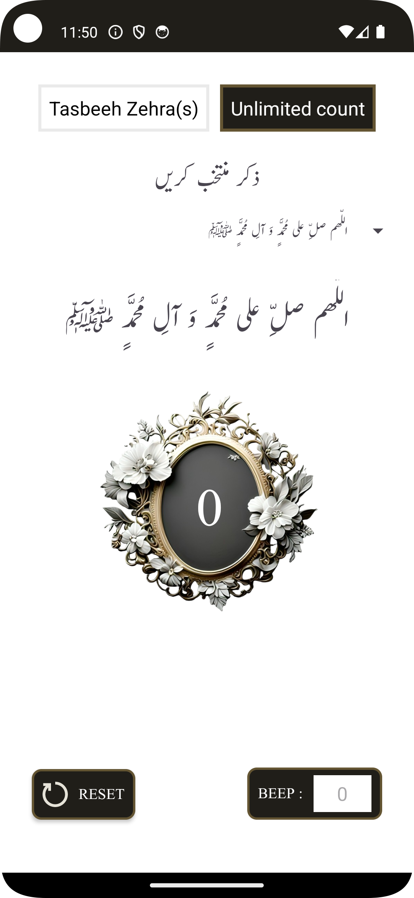
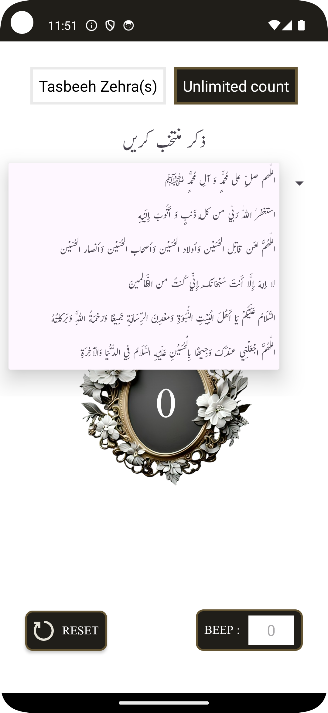

# Tasbeeh Counter App

**Tasbeeh Counter App** is a simple and efficient tool designed to assist in keeping track of Tasbeeh counts for prayers and recitations. The app offers unlimited counting, Zikr selection, sound alerts, and vibration triggers for a more immersive user experience.

## Features

- **Unlimited Tasbeeh Counting:**
    - No limitations on the number of Tasbeeh recitations.

- **Customizable Zikr Selection:**
    - Choose from a list of pre-defined Zikr from the dropdown menu.

- **Sound Alerts:**
    - A customizable beep sound (MediaPlayer) plays when the count reaches the specified value.

- **Vibration Trigger:**
    - Device vibration is triggered when the counter reaches the desired number (works even on older Android devices).

- **Reset Functionality:**
    - Reset the counter to zero with a single click.

- **Clean & Intuitive UI:**
    - Elegant design with custom fonts and easy-to-read text.

## Screenshots

### Splash Screen


### Tasbeeh e Zehra Counter Screen


### Unlimited Counter Screen


### Unlimited Counter Screen (Variation)



## How to Use

1. Select a Zikr from the dropdown menu.
2. Tap anywhere on the screen to increment the Tasbeeh counter.
3. Enter a specific count to trigger sound and vibration when reached.
4. Use the **Reset** button to restart the counter.

## Installation

1. Clone this repository to your local machine:
   ```bash
   git clone https://github.com/HassanMohtashim/Tasbeeh-Counter
